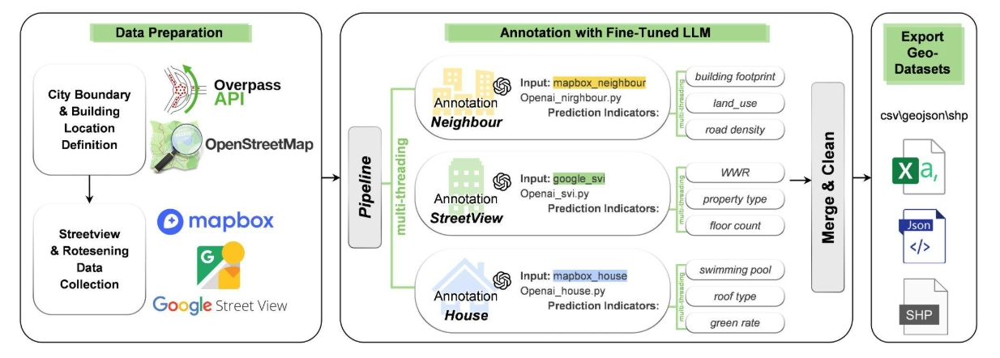

# BuildingView-Turbo



This is the official repository for "*Seeing Cities Through Building's Eyes: Building Center Database Construction Using Satellite and Street View Imagery with Multi-Version LLMs*".

Authors：[Zongrong Li](https://jasper0122.github.io/)，[Yunlei Su](https://suyunlei.github.io/homepage/)，[Wufan Zhao](https://wufan-zhao.github.io/)¹  
¹Corresponding Author: [wufanzhao@hkust-gz.edu.cn](mailto:wufanzhao@hkust-gz.edu.cn)  

Previous version: [BuildingView](https://github.com/Jasper0122/BuildingView)  

---

## Synopsis

Buildings provide unique insights into the urban environment, encompassing physical, functional, and aesthetic dimensions. Traditional approaches often rely on remote sensing (sky-view) or street-level imagery (street-view) for building information extraction but tend to focus on isolated perspectives. These methods limit the holistic understanding of urban morphology and functionality.  

**BuildingView-Turbo** addresses this gap by integrating sky-view and street-view imagery using advanced computational techniques. This novel framework enables the construction of a comprehensive, multi-city building database for deeper urban analysis.

---

## About This Python Package

### Prerequisites
Before you start, install dependencies:  
```bash
pip install -r requirements.txt
```

- APIs needed:
- [Google Street View API](https://developers.google.com/maps/documentation/streetview)
- [Mapbox API](https://www.mapbox.com/)
- [OpenAI API](https://platform.openai.com/docs/)

### Features and Usage

#### 1. Retrieve Building Data

##### 1.1 Using City and Country Names
- **`city_name.py`**  
Fetch city names and their countries:  
```bash
python city_name.py "NY"
```

- **`Overpass.py`**  
Retrieve building data for a specific city and country:  
```bash
python Overpass.py "NewYork" "United States" 100
```

Features include:  
- Fetching bounding box coordinates  
- Querying Overpass API for building details  
- Saving data categorized by building type  

##### 1.2 Using Bounding Box Coordinates
- **`Overpass_bounding_box.py`**  
Retrieve building data via bounding box:  
```bash
python Overpass_bounding_box.py "NewYork" 100 40.477399 -74.259090 40.917577 -73.700272
```

#### 2. Download Street-View and Satellite Images
- **`Image_downloader.py`**  
Use this script to download satellite images (via Mapbox API) and street view images (via Google API):  
```bash
python Image_downloader.py "Data/NewYork_United States_100.jsonl"
```

#### 3. Fine-Tune LLM for Auto-Annotation
- **`Annotation_processor.py`**  
Sequentially processes images for street view, neighborhood, and house-level analysis:  
```bash
python Annotation_processor.py "Data/NewYork_United States_100.jsonl"
```
- Progress is saved, and interrupted runs can resume from the last completed step.

#### 4. Data Preprocessing and Merging
- **`Clean_merger.py`**  
Automates preprocessing and merging:  
```bash
python Clean_merger.py "Data/NewYork_United States_100.jsonl"
```

#### 5. Visualization and Mapping
- **`Maper.py`**  
Generates maps from processed data:  
```bash
python Maper.py --base_file "Data/NewYork_United States_100.jsonl"
```

#### 6. Export Results
- **`Result_export.py`**  
Export final results as CSV, GeoJSON, or Shapefile:  
```bash
python Result_export.py --base_file "Data/NewYork_United States_100.jsonl"
```

---

## Outputs
The project generates:  
- **Processed Building Data**  
- **Visualizations and Maps**  
- **Exported Results** in multiple formats (CSV, GeoJSON, Shapefile)  


---

## License
*MIT License*  

## Acknowledgments
- Contributors  
- Tools and APIs used  

---
